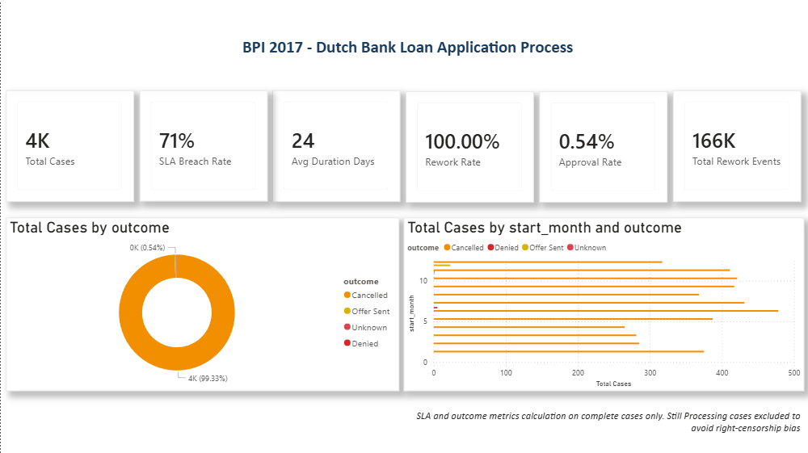
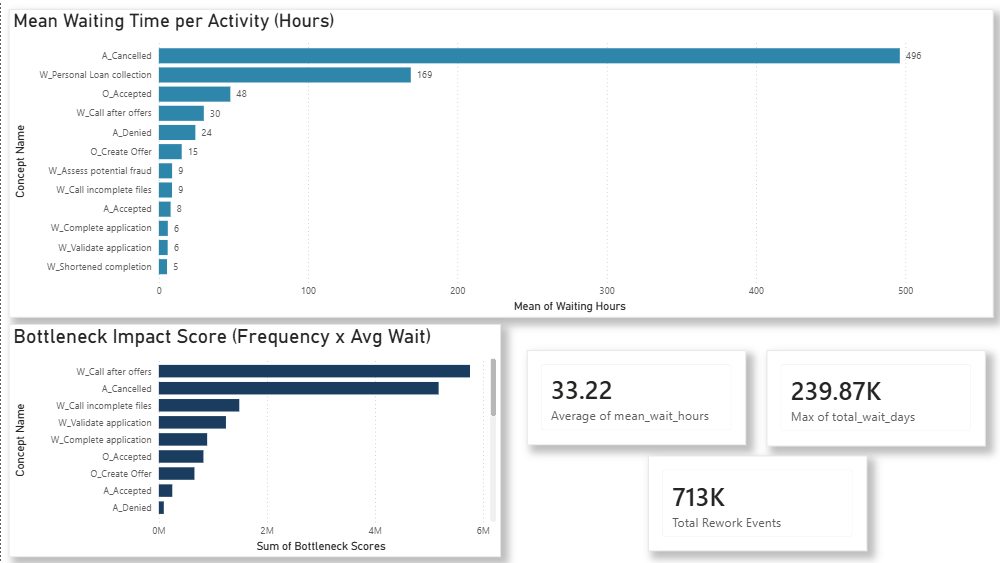
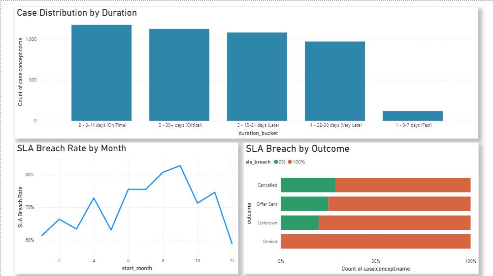
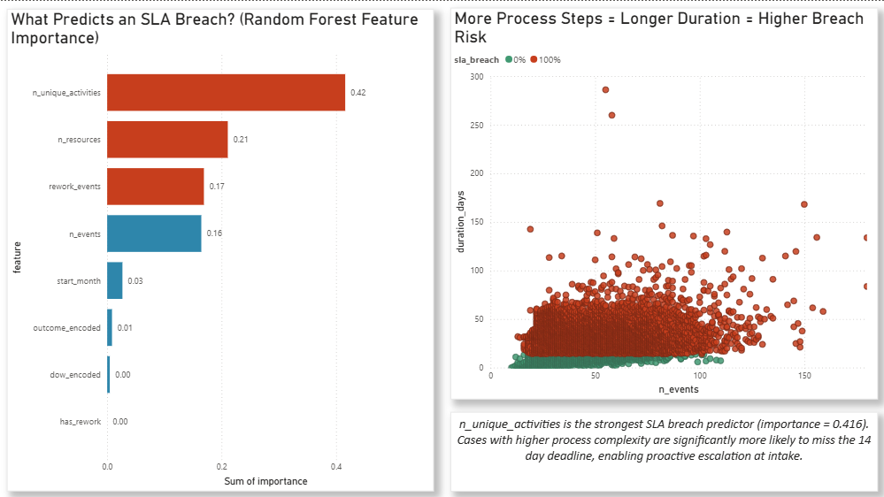
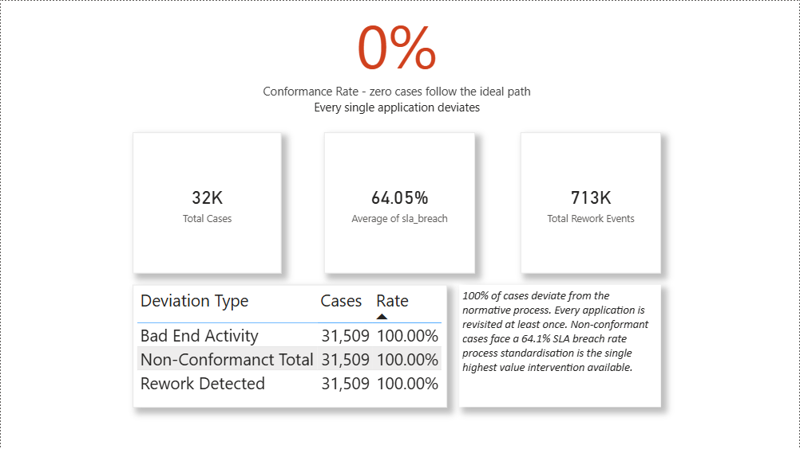

"""
generate_readme.py
Run this from your project root to create README.md

    python generate_readme.py

Edit the three variables at the top before running.
"""

LINKEDIN_LINK = "www.linkedin.com/in/dhruvdc007"
GITHUB_LINK   = "https://github.com/hjonks"

# ─────────────────────────────────────────────────────────────────────────────

content = f"""# Process Mining: Dutch Bank Loan Applications
**BPI Challenge 2017 · Python · Power BI · scikit-learn**

---

I came across the BPI 2017 dataset during my MSc and got genuinely curious about what was actually going wrong inside a bank's loan process. Not the high-level "efficiency improvements" type of answer — the specific, measurable, *this exact activity is where cases go to die* type of answer. That's what this project is.







---

## What I found

The headline number is 0%. As in, zero cases out of 31,509 follow the process the way it was designed. Every single application deviates from the normative model. That was surprising even after running the conformance check twice.

The bottleneck is `W_Call after offers`. 191,091 times this activity ran across the dataset, with a mean queue time of 33.2 hours each occurrence. Stack that up and you get 239,868 cumulative days of process delay from one activity. That's one number I kept coming back to.

A few other things that stood out:

- 712,859 rework events across the dataset. Every case has at least one activity repeated, not a few edge cases, literally all of them
- The ML model (Gradient Boosting, AUC 0.816) found that `n_unique_activities` is far and away the strongest SLA breach predictor, importance score 0.416. More unique activities in a case = longer duration = almost certain to miss the 14 day deadline
- 64.1% of completed cases breach the SLA. The "Still Processing" cases in the raw data are excluded from this they're right-censored, meaning the bank snapshot was taken before those cases resolved, so including them would inflate breach rates artificially

---

## The dataset

Real event log from a Dutch bank's loan application process, released as part of the BPI Challenge 2017. 1,202,267 events across 31,509 cases covering a full year of operations.

Download: https://data.4tu.nl/articles/dataset/BPI_Challenge_2017/12696884
Place the `.xes` file in `data/raw/` before running anything.

---

## Project structure

```
Process_Mining_Project/
│
├── data/
│   ├── raw/                          ← put the XES file here
│   └── processed/                    ← cleaned by eda_discovery.py script
│
├── results/
│   ├── figures/                      ← 4 portfolio charts
│   ├── tables/                       ← CSVs for Power BI
│   └── reports/                      ← summary stats + CV bullets
│
├── scripts/
│   ├── paths.py                      ← path config, edit ROOT here
│   ├── eda_discovery.py
│   └── bottleneck_ml.py
│
└── powerbi/
    └── Process_Mining_Dashboard.pbix
```

---

## Running it

```bash
pip install pm4py pandas numpy matplotlib seaborn scikit-learn scipy openpyxl
```

Before running, open `scripts/paths.py` and set line 17 to your actual project path:
```python
ROOT = Path(your_path_here).resolve()
```

Then:
```bash
cd scripts
python eda_discovery.py
python bottleneck_ml.py
```

eda_discovery.py takes a few minutes on the real XES file. bottleneck_ml.py a bit longer because of the ML cross validation. Close any CSV files you have open in Excel before running bottleneck_ml.py Windows locks open files and Python cannot overwrite them.

---

## The analysis

**EDA and process discovery**

Loaded the XES event log via pm4py, cleaned it, and built case level features from scratch. Duration, SLA breach flag (14 day threshold), outcome classification, rework detection. Also ran process variant analysis to see how many different activity sequences exist across 31,509 cases.

**Bottleneck analysis, ML, and conformance**

*Bottleneck:* Calculated inter activity waiting time for every single transition in every case. Aggregated by activity to find mean wait, total cumulative delay, and a composite impact score (frequency × average wait). `W_Call after offers` wins by a large margin.

*Machine learning:* Compared Random Forest, Gradient Boosting, and Logistic Regression using 5 fold stratified cross-validation. Gradient Boosting came out on top at AUC 0.816. Process complexity features dominate `n_unique_activities`, `n_events`, `n_resources`. The bank could flag high-risk cases at intake just by counting expected activity types before the case even starts.

*Conformance:* Defined what a correct process looks like (right start activity, right end activity, no rework markers) and checked every case against it. 0% pass.

---

## Dashboard

Five pages built in Power BI Desktop on the real data:

1. **Executive Summary** — headline KPIs, outcome distribution, monthly trend
2. **Bottleneck Analysis** — waiting time by activity, impact score, cumulative delay
3. **SLA Performance** — duration distribution, breach rate by month, outcome vs SLA
4. **Root Cause Analysis** — feature importance, complexity vs duration scatter
5. **Process Conformance** — conformance rate, deviation breakdown, insight summary

All SLA and outcome metrics exclude "Still Processing" cases to avoid right censorship bias.

---

## Stack

Python 3.10+ · pm4py · pandas · scikit-learn · matplotlib · seaborn · Power BI Desktop

---

## If you're reading this for hiring purposes

The numbers are real, pulled from a publicly available dataset, not generated or inflated. Happy to walk through any part of the methodology.

---

## Dataset credit

van Dongen, B. (2017). *BPI Challenge 2017*. 4TU.ResearchData.
https://doi.org/10.4121/uuid:5f3067df-f10b-45da-b98b-86ae4c7a310b

---

**Dhruv Chaudhary** — MSc Business Analytics & Decision Science, University of Leeds
dhruvdc007@gmail.com
[LinkedIn]({LINKEDIN_LINK}) · [GitHub]({GITHUB_LINK})
"""

output_path = "README.md"

with open(output_path, "w", encoding="utf-8") as f:
    f.write(content)

print(f"README.md written to {output_path}")
print("Remember to update the three links at the top of this script before running.")
