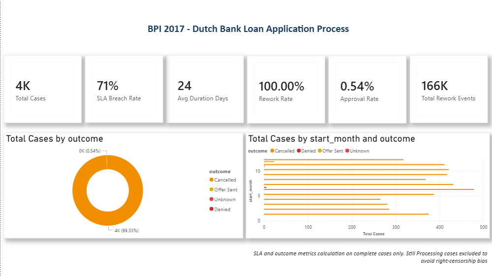
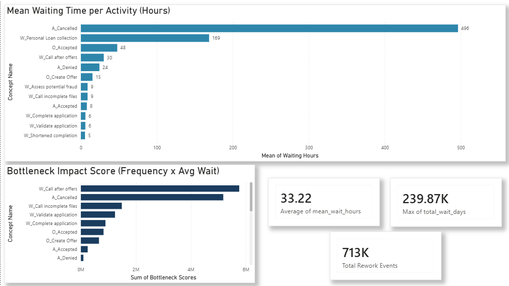
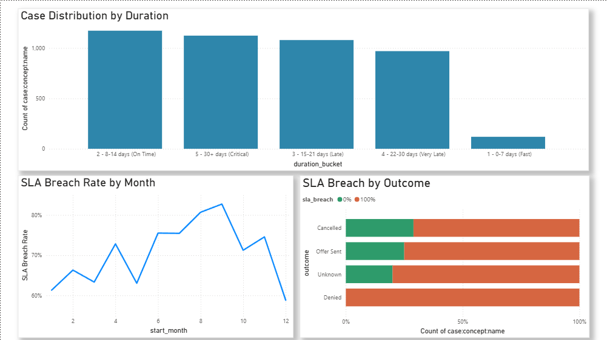
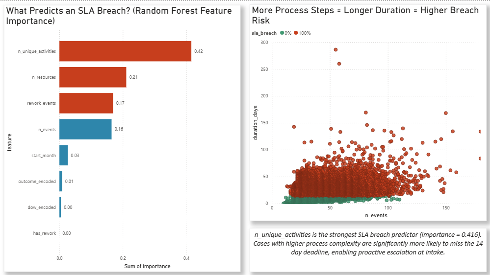
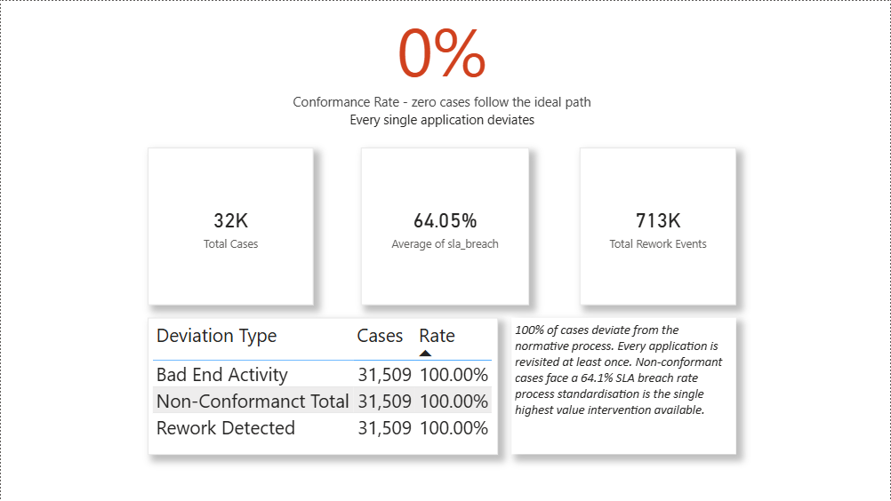

# Process Mining: Dutch Bank Loan Applications

**BPI Challenge 2017 · Python · SQL (DuckDB) · Power BI · scikit-learn**

Where does a bank's loan process actually lose time, and can a late application be spotted on day one? This project answers both questions with 1,202,267 real system events from 31,509 loan applications. The analysis was built in Python and pm4py, then rebuilt independently in SQL to check every headline number.

## In 30 seconds

| Question | Answer | Evidence |
|---|---|---|
| How often is the 14 day SLA missed? | **64.1%** of applications (20,183 of 31,509) | Python and `sql/queries/03`, RM02 |
| Where does the time go? | **239,868 cumulative days** of waiting before one activity, `W_Call after offers` (191,091 occurrences) | RM04 |
| Is that a staff backlog? | Mostly not. **86.7%** of that delay is call-back tasks suspended between calls to the customer | RM11 |
| How fast does the bank decide? | Median **0.9 days** from application to first offer, then a median **13.8 days** waiting for the customer to accept | PA02, PA09 |
| Who breaches most? | Cancelled applications (86.0% breach) versus paid out loans (53.7%) | RM10 |
| Can breaches be predicted at intake? | Yes. Gradient boosting reached **AUC 0.816** on held-out cases | `scripts/bottleneck_ml.py` |

**So what.** The SLA problem is mainly the wait for customers to return signed offers, not slow decisions. The cheapest levers are faster customer follow-up (reminders, e-signature, a clear return deadline) and early escalation of the applications the model flags as high risk.

## Dashboard











## What the SQL rebuild checked

Rebuilding the analysis in SQL reproduced every headline figure exactly, and it also caught two measurement effects worth stating plainly.

1. **Lifecycle logging inflates rework.** Counting every repeated event gives 712,859 "rework" events in 100% of cases. But work items are logged at schedule, start, suspend, resume and complete, so one task can appear five times. Counting completed tasks only gives **69,668 genuine repeats in 51.5% of applications**.
2. **The 64.1% covers all applications.** It includes cancellations that close automatically after about 30 days, which is why cancelled applications breach far more often than paid out ones.
3. **Conformance.** The 0% conformance result used simple start, end and rework rules. Because of the lifecycle logging above, treat it as a signal that the log needs a proper process model before conformance can be scored, not as proof that every case failed.

See [`sql/README.md`](sql/README.md) to run it. It takes about a minute on a laptop.

## Methods

**Process discovery and data quality (Python, pm4py, SQL).** Loaded the XES log, removed exact duplicates, profiled completeness, duplicates, timestamp order, boundary effects and actor types (`sql/queries/01_data_quality_profile.sql`), then built case level features: duration, SLA flag, final state, variants and rework.

**Bottleneck analysis.** Measured the wait before every event, ranked activities by mean wait times frequency, and tested the result both ways: attributing the wait to the activity the case is sitting at, and to the activity it is waiting for (PA03, PA04).

**Predicting breaches.** Compared random forest, gradient boosting and logistic regression with 5 fold stratified cross validation. Gradient boosting scored AUC 0.816 on the test set. The strongest predictor was the number of distinct activities in a case (importance 0.416).

**Reporting.** A five page Power BI dashboard covering executive KPIs, bottlenecks, SLA performance, root cause and conformance.

## Project structure

```
Process_Mining_Project/
├── data/               raw XES log goes in data/raw/ (not tracked)
├── scripts/            Python pipeline: eda_discovery.py, bottleneck_ml.py, paths.py
├── sql/                SQL rebuild: queries, runner, CSV outputs, README
├── results/            figures, tables and summary reports
└── powerbi/            Power BI dashboard (not tracked)
```

## Running the Python pipeline

```bash
pip install pm4py pandas numpy matplotlib seaborn scikit-learn scipy openpyxl
```

Set `ROOT` in `scripts/paths.py` to your project path, put the XES file in `data/raw/`, then:

```bash
cd scripts
python eda_discovery.py
python bottleneck_ml.py
```

Close any CSVs open in Excel first, because Windows locks open files.

## Stack

Python 3.10+ · pm4py · pandas · scikit-learn · DuckDB SQL · Power BI Desktop

## Dataset

van Dongen, B. (2017). *BPI Challenge 2017*. 4TU.ResearchData.
https://doi.org/10.4121/uuid:5f3067df-f10b-45da-b98b-86ae4c7a310b

---

**Dhruv Chaudhary** · MSc Business Analytics and Decision Sciences, University of Leeds
Open to operations, MI and risk analyst roles in the UK · Eligible for the UK Graduate visa, no sponsorship needed
[LinkedIn](https://www.linkedin.com/in/dhruvdc007) · [GitHub](https://github.com/hjonks) · dhruvdc007@gmail.com
